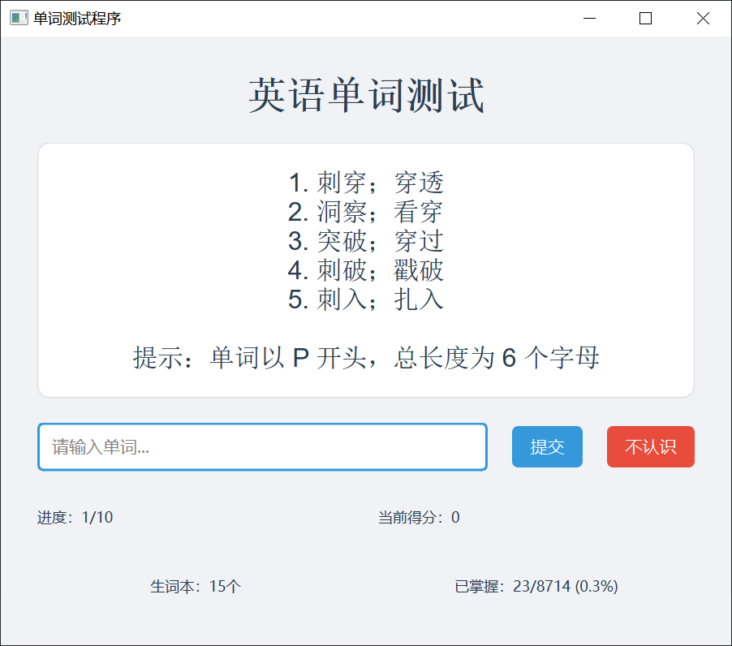

## 快速开始

Forked From [Ceelog/DictionaryByGPT4](https://github.com/Ceelog/DictionaryByGPT4)

增加内容：使用Python写了一个界面自测单词量

使用了deepseek的API，可以获取单词的释义


安装方法：

```bash
 pip install -r requirements.txt
```

另外需要获取DeepSeek的API_KEY，可以到[DeepSeek](https://deepseek.ai/)注册

然后填入到系统的环境变量中。


运行命令：

```bash
python word_test.py
```


## 截图

